# NDI Output Integration & Raspberry Pi HLS Setup Guide

This guide describes how to stream the **IntelliSTAR broadcast over NDI (Network Device Interface)** across your local network and convert it into **HTTP Live Streaming (HLS)** using a **Raspberry Pi**.

For the opt-in OBS Browser Source backend, see [Background OBS Setup](OBS_SETUP.md).
It bypasses Puppeteer/FFmpeg capture, keeps existing forecast controls, and starts
OBS minimized with a saved DistroAV NDI output. Run `npm run obs:check` after the
one-time setup, then `npm run start-obs`. This path is experimental until verified
with your actual NDI receiver; the instructions below describe the legacy sender.

---

## 1. Architecture Overview

```mermaid
flowchart LR
    subgraph Broadcaster["Broadcaster (Steam Deck / Linux PC)"]
        direction TB
        Puppeteer["Puppeteer Chromium<br/>(Weather Graphics + WebAudio)"] --> FFmpegSender["FFmpeg (libndi_newtek)"]
        FFmpegSender --> NDIOutput["NDI Stream: 'IntelliSTAR'<br/>(Raw 4:2:2 Video + PCM 48kHz Audio)"]
    end

    subgraph LAN["Local Area Network (LAN / Wi-Fi / Ethernet)"]
        NDIOutput -. "mDNS Discovery & Low-Latency IP" .-> RPiReceiver["Raspberry Pi Receiver"]
    end

    subgraph RaspberryPi["Raspberry Pi 3 / 4 / 5"]
        direction TB
        RPiReceiver --> RPiFFmpeg["FFmpeg Transcoder<br/>(h264_v4l2m2m / libx264)"]
        RPiFFmpeg --> HLSOutput["HLS Packager<br/>(index.m3u8 + index*.ts)"]
        HLSOutput --> HTTPServer["Local HTTP Web Server<br/>(Port 8080 / Nginx)"]
    end

    subgraph Viewers["Clients & TVs"]
        HTTPServer --> StreamViewers["VLC / Apple TV / Roku / Browsers<br/>http://raspberrypi:8080/index.m3u8"]
    end
```



### Why NDI to Raspberry Pi?
- **Separate Final Encoding**: The receiver can handle HLS encoding, but NDI itself still compresses video and consumes CPU and network bandwidth on the broadcaster. Raw frames passed into the NDI SDK are not uncompressed transport over the network.
- **Dedicated HLS Transcoder**: The Raspberry Pi handles HLS segmenting and serves streams to media players, Smart TVs, and local devices.
- **Instant LAN Discovery**: NDI uses mDNS (Avahi/Bonjour). Receivers automatically discover the `"IntelliSTAR"` stream without needing hardcoded IP addresses.

---

## 2. Broadcaster Setup (Steam Deck / PC)

### Configuration Options in `stream-config.js`
You can enable NDI mode in `stream-config.js` or via environment variables:

```javascript
// stream-config.js
module.exports = {
  outputMode: 'ndi',           // 'hls', 'rtmp', 'udp', or 'ndi'
  ndiName: 'IntelliSTAR',       // NDI stream name broadcasted on LAN
  ndiPixelFormat: 'uyvy422',   // 'uyvy422' (recommended), 'bgra', or 'bgr0'
};
```

### Environment Variables
| Variable | Default | Description |
| :--- | :--- | :--- |
| `STREAM_MODE` | `hls` | Set to `ndi` to enable NDI output. |
| `STREAM_NDI_NAME` | `IntelliSTAR` | The name advertised on the local network. |
| `STREAM_NDI_PIXEL_FORMAT` | `uyvy422` | Pixel format (`uyvy422`, `bgra`, `bgr0`). |
| `STREAM_FFMPEG_PATH` | `ffmpeg` | Custom path to an NDI-enabled FFmpeg binary. |

### Running with NDI
```bash
STREAM_MODE=ndi npm run start-iptv
```
Or with custom stream name and custom FFmpeg binary:
```bash
STREAM_MODE=ndi STREAM_NDI_NAME="WeatherStation" STREAM_FFMPEG_PATH="/usr/local/bin/ffmpeg-ndi" npm run start-iptv
```

> [!TIP]
> **Zero-Fuss Setup (No Full FFmpeg Compilation Needed)**:
> While FFmpeg can use `libndi_newtek`, compiling full FFmpeg from source on SteamOS is slow and breaks due to stripped C headers.
> We provide a **turnkey setup helper** that links against the official NewTek NDI SDK and builds a lightweight bridge (`bin/ndi-bridge`) in under 2 seconds:
> ```bash
> bash scripts/setup-ndi.sh
> ```
> Once built, `npm run start-ndi` automatically routes raw broadcast video & PCM audio through the NDI bridge.
> Alternatively, if you already have a custom FFmpeg binary compiled with `libndi_newtek`, you can point to it directly:
> ```bash
> export STREAM_FFMPEG_PATH="/path/to/ffmpeg-ndi"
> ```

---

## 3. Raspberry Pi Receiver & HLS Transcoder

We provide a turnkey script on the Raspberry Pi: [`scripts/raspberry-pi-ndi-to-hls.sh`](file:///home/deck/app/scripts/raspberry-pi-ndi-to-hls.sh).

### Quick Start on Raspberry Pi
Copy the script to your Raspberry Pi and run:

```bash
# 1. Discover active NDI sources on the network
./scripts/raspberry-pi-ndi-to-hls.sh --list

# 2. Ingest "IntelliSTAR" and transcode to HLS with a built-in HTTP server on port 8080
./scripts/raspberry-pi-ndi-to-hls.sh --source "IntelliSTAR" --serve 8080
```

The stream will immediately be playable on your network:
```
http://<raspberry-pi-ip>:8080/index.m3u8
```

### Command-line Options for `raspberry-pi-ndi-to-hls.sh`
- `--source <name>`: NDI source name (default: `IntelliSTAR`).
- `--dir <path>`: Directory where HLS `.m3u8` and `.ts` files are saved (default: `./hls-live`).
- `--segment-time <sec>`: HLS segment duration in seconds (default: `4`).
- `--list-size <num>`: Playlist window size (default: `8` segments, approx. 32s buffer).
- `--bitrate <rate>`: Target video bitrate for HLS (default: `4000k`).
- `--serve [port]`: Starts a lightweight Python HTTP server on the specified port (default: `8080`).

### Hardware Acceleration Notes for Raspberry Pi:
- **Raspberry Pi 5**: Uses `libx264` (`-preset veryfast`). The Cortex-A76 CPU effortlessly encodes 1080p30 / 720p60 in real-time with under 25% CPU utilization.
- **Raspberry Pi 4 / 3**: Automatically uses the hardware encoder (`h264_v4l2m2m`) if available, falling back to `libx264`.

---

## 4. Troubleshooting & Verification

1. **Firewall & Network Discovery**:
   - NDI relies on mDNS for discovery (UDP port `5353`) and dynamic TCP/UDP ports in range `5960-5970`.
   - Ensure broadcaster and Raspberry Pi are on the same local subnet / VLAN.
2. **Checking NDI Stream with VLC / NDI Tools**:
   - You can test playback on any PC or Mac on the network using the official NewTek **NDI Studio Monitor** / **NDI Video Monitor**.
3. **Logs & Diagnostics**:
   - When IntelliSTAR starts in NDI mode, the startup card will show:
     ```
     Target Output : NDI: "IntelliSTAR"
     Encoder       : rawvideo (NDI)
     ```

